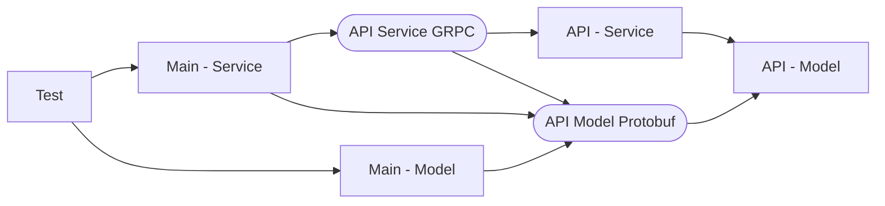

# Bazel Java Template

The Bazel Java Template sets up a pre-wired Java 17, Junit 5 project.

The following files are the controlling files of building with bazel:

* WORKSPACE - is the bazel workspace file containing the rules applicable
  to the project. The variables defined at the top of the file allow you
  to configure dependencies and the java version.
* .bazelrc - is used to control common bazel commands for the build lifecycle.
* BUILD/* - are files used to support the build process.

## Source Code

Unlike Maven or Gradle where you'll need to install Java, Mave, and Gradle, 
with Bazel, you'll only need to install Bazelisk. Once installed, the version
of Java you're compiling with will be put into the build cache. This keeps it
separate and distinct from the operating system.

Bazel best practices places a "BUILD.bazel" file in the directories you want to
build. In theory a developer can create any directory structure, in practice
most still follow the Maven directory structure for ease of maintenance.

### src/main/api

Is the directory holding the Protocol Buffer API definitions.

### src/main/java & src/main/resources

Similar to a Maven or Gradle project these are the accepted standard directories
for the primary programs source code and resources.

### src/test/java & src/test/resources

Similar to Maven or Gradle projects these are the accepted standard directories
for the test source code and resources.

